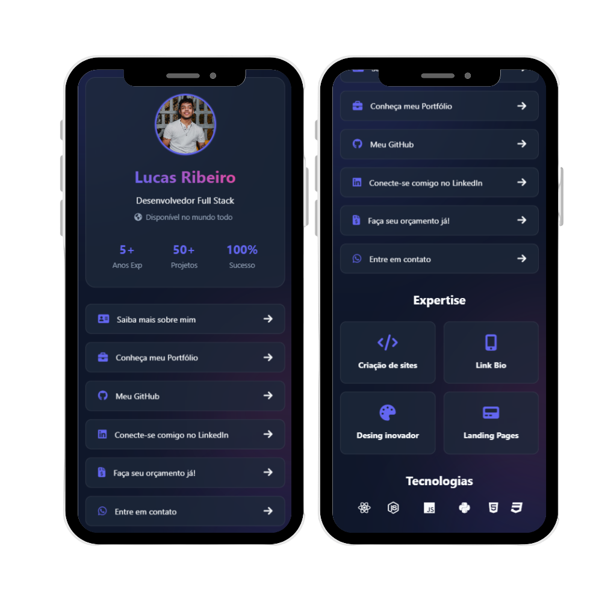

# Lucas Ribeiro │ Link Bio

# Imagem do Projeto

Este repositório contém o código-fonte do meu Link bio pessoal. É uma vitrine digital onde apresento minhas habilidades e centralizo meus links para contato. O site demonstra minha abordagem ao desenvolvimento web, focando em design responsivo, interatividade e experiências de usuário otimizadas.

## Tecnologias e Ferramentas

O site foi construído utilizando uma variedade de tecnologias e ferramentas modernas, destacando minha experiência e versatilidade no desenvolvimento web:

- **HTML & CSS**: Estruturação e estilização responsiva do site.
- **JavaScript**: Utilizado para criar interatividade e funcionalidades dinâmicas.
- **AOS (Animate On Scroll)**: Para animações elegantes ao rolar a página.
- **FontAwesome**: Ícones estilizados e de fácil implementação.

## Características do Site

### Design e Usabilidade

- **Design Responsivo**: Totalmente adaptável a diferentes tamanhos de tela, garantindo uma experiência de usuário consistente em dispositivos móveis e desktops.
- **Animações Interativas**: Utilizando AOS, o site proporciona uma experiência visualmente atraente e interativa.

### Funcionalidades
- **Botões de Acesso Rápido**: Inclui botões para WhatsApp, Linkedin, Portfólio e etc... Melhorando a navegabilidade e acessibilidade.

### SEO e Performance

- **Otimizado para SEO**: Meta tags e descrições cuidadosamente escolhidas para melhorar a visibilidade do site em motores de busca.
- **Alto Desempenho**: O código foi otimizado para carregamento rápido e desempenho eficiente.

## Contribuições e Contato

Estou aberto a colaborações e feedback. Se você tiver sugestões ou quiser discutir possíveis projetos, por favor, entre em contato comigo:

- **Site**: [Lucas Ribeiro](https://lucasribeirodev.netlify.app/)
- **Email**: [Lucas.mRibeiro.Dev@gmail.com](mailto:Lucas.mRibeiro.Dev@gmail.com)
- **LinkedIn**: [Lucas Ribeiro](https://www.linkedin.com/in/lucas-ribeiro-7218a0153/)
- **WhatsApp**: [(41) 99523-4918](https://wa.me/5541995234918)

Obrigado por visitar meu portfólio!
